# SECTION 1: Getting Started with the Value Proposition Canvas

## LESSON 1: Introduction to the Value Proposition Canvas and Jobs-To-Be-Done

### STEP 1: Welcome

In this first lesson, we introduce the Value Proposition Canvas and how it can help you tell a story about the value your products and services create for customers. After this introduction, you will dive right into the heart of the Value Propositions Canvas by exploring the jobs-to-be done concept, customer pains, and customer gains. 

### STEP 2: Introduction  

[RESOURCE: The Value Proposition Canvas](/resources/canvases-and-main-tools/the-value-proposition-canvas.pdf)

[Video](https://platform.strategyzer.com/training/courses/mastering-value-propositions/1/1/2)

### STEP 3: Customer Jobs-To-Be-Done

The jobs-to-be done framework is the first of six building blocks within the Value Proposition Canvas. This method is different from traditional marketing approaches.

[Video](https://platform.strategyzer.com/training/courses/mastering-value-propositions/1/1/3)

- Origins of the #jtbd concept

Old way vs "Customer Jobs" way
- Traditional marketing used to describe WHO we are targeting and WHAT they want
- better to ask "what jobs are they trying to get done"
  - Henry Ford "If I had asked what people wanted they would have said 'a faster horse'".
  - Ask customers not what products they want, ask what JOB they are trying to get done.

#### Jobs-To-Be-Done
- what a customer is trying to get done (in her work or in her life). 
- includes
  - _tasks_ trying to perform and complete
  - _problems_ trying to solve
  - _needs_ trying to satisfy
- customers perform a job in a particular situation or context with more or less constraints

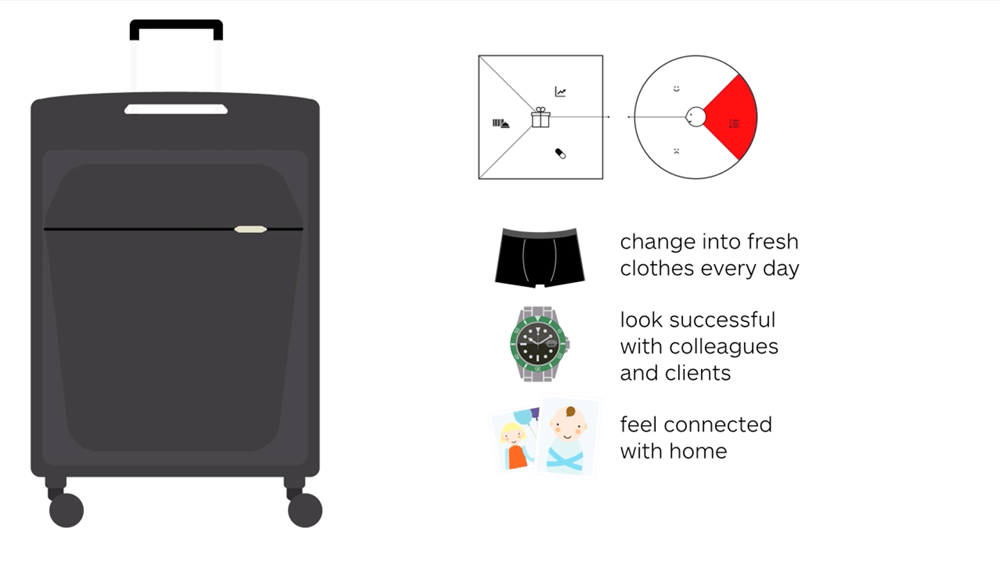
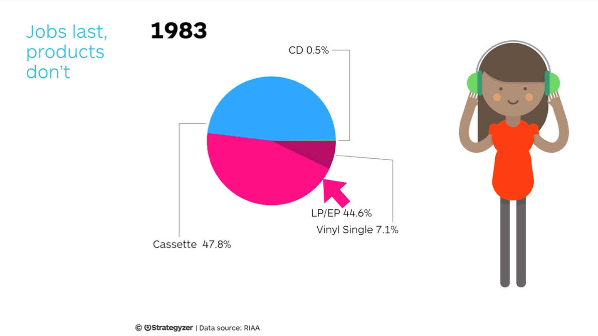
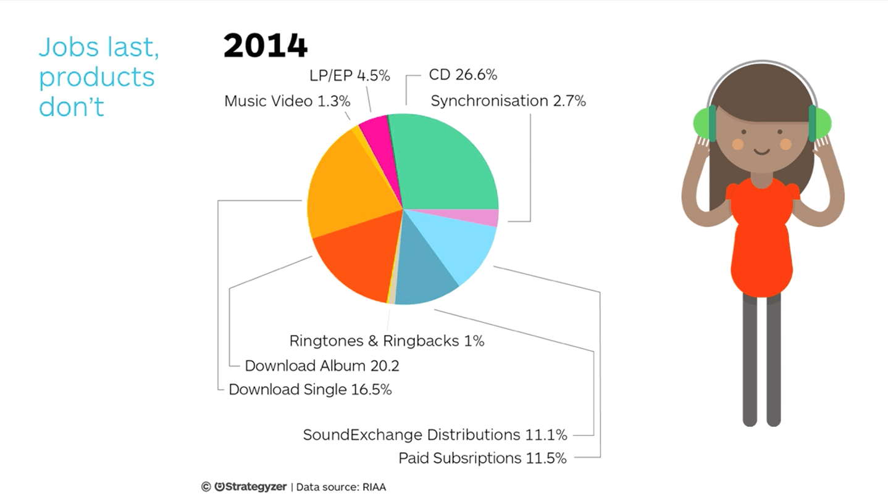
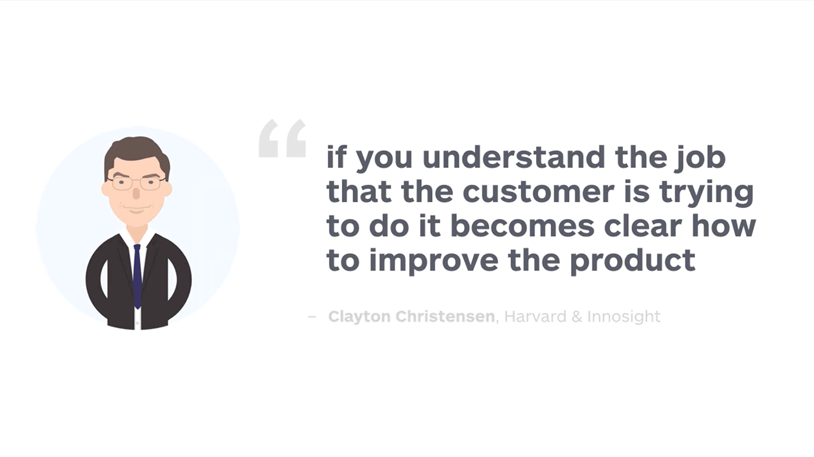
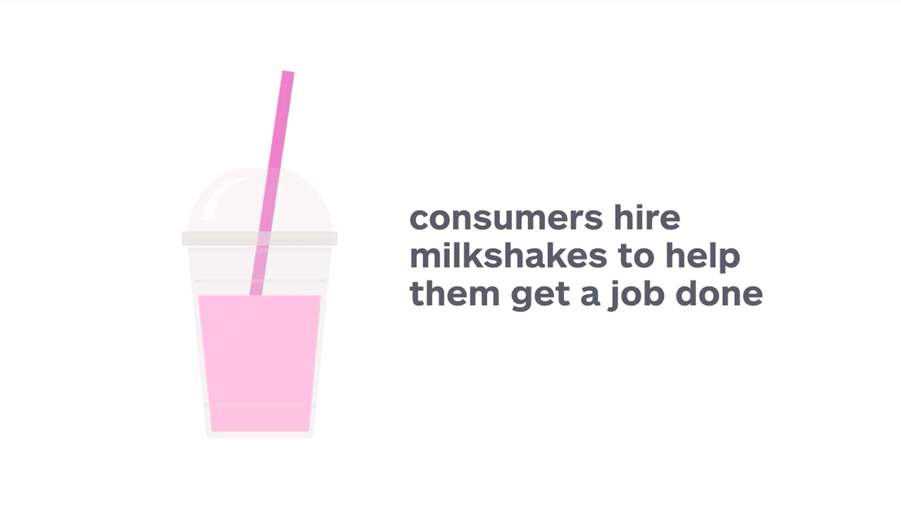
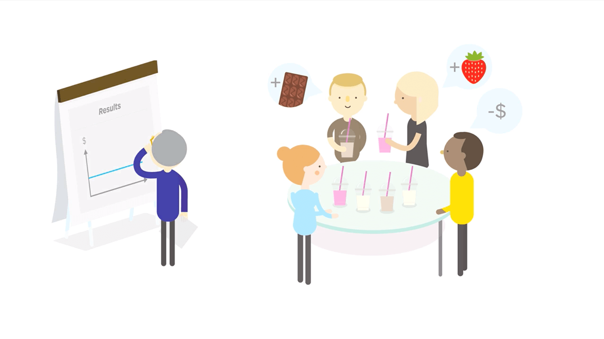

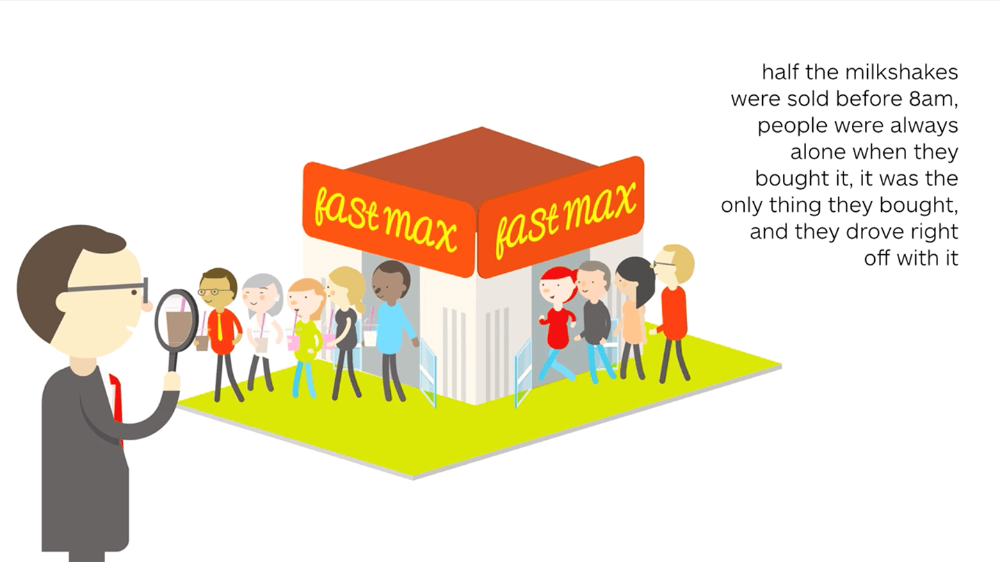
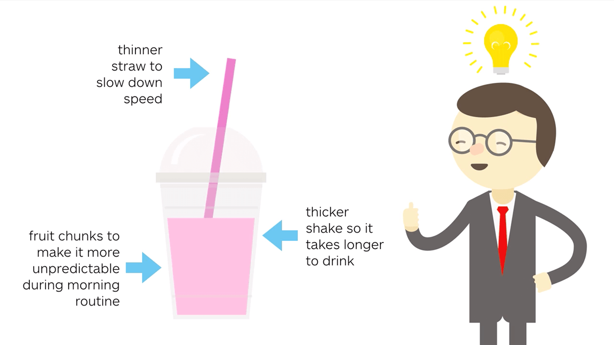
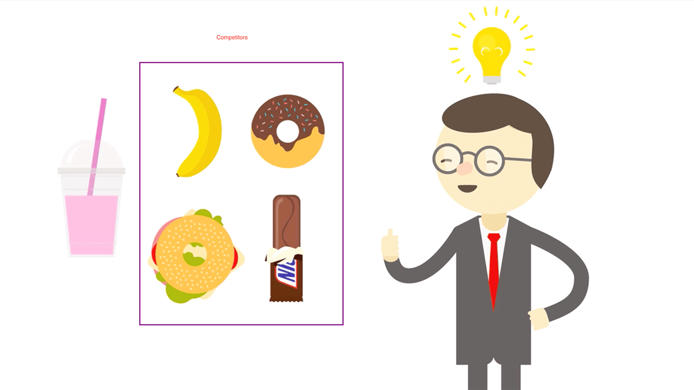
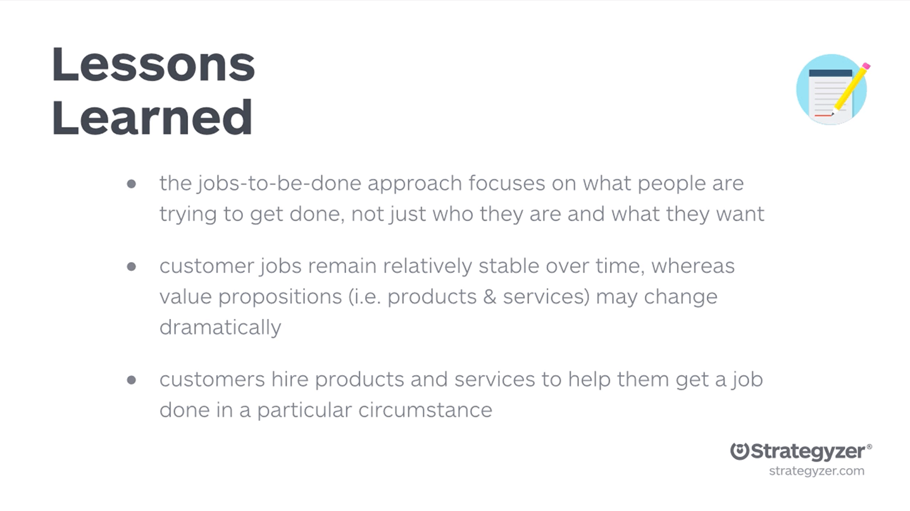

### STEP 4: Exercise - Jobs-To-Be-Done in Air Travel
Example: Imagine you are traveling by airplane to a business meeting. What jobs are you trying to get done as a business traveler?

- find a ride to the airport
- get to the hotel
- entertainment (books, magazines, etc.)
- move luggage around the airport
- get sleep on the airplane
- feel comfortable on the airplane
- get work done on the airplane
- feel connected with the home office
- dress appropriately for all anticipated occasions
- let business contacts know where I am and when to expect me
- let family know where I am and when to expect me
- find parking at the airport
- find my luggage if checked
- stay caffeinated
- maintain healthy eating habits while traveling
- maintain workout schedule while traveling
- find a place to workout (run) in foreign location

### STEP 5: Job Types
- 1) Function - tasks customers try to perform
- 2) Social - how customer want to be perceived by others
- 3) Emotional - a specific emotional state customers seek
- 4) Supporting - supporting jobs in the context of purchasing and consuming value

Categorize jobs and then rank them with the most important on top and least on the bottom. May need to GOOB for this.

Refer to the [Customer Jobs Trigger Questions](../resources/value-proposition-supporting-tools/customer-gains-trigger-questions.pdf)

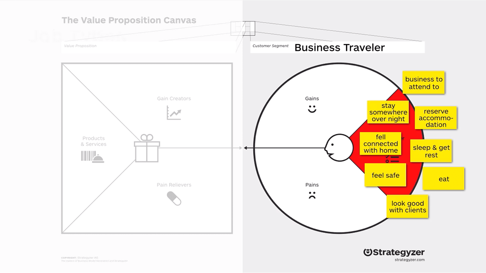
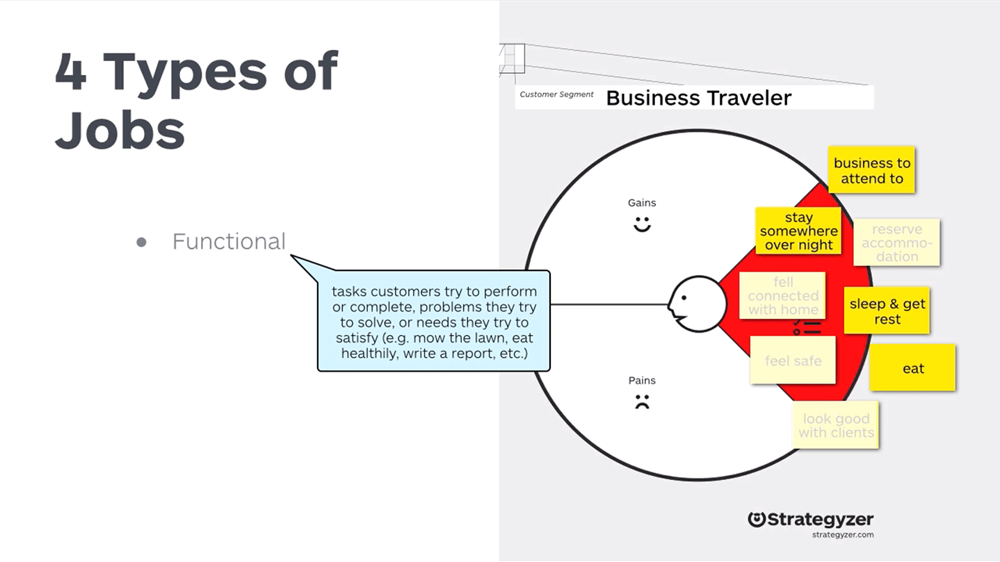
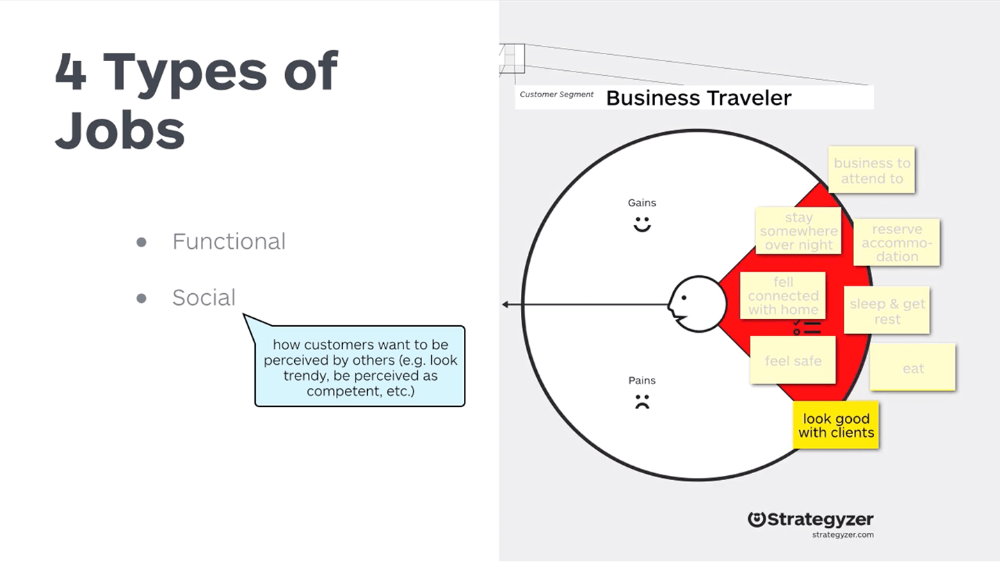
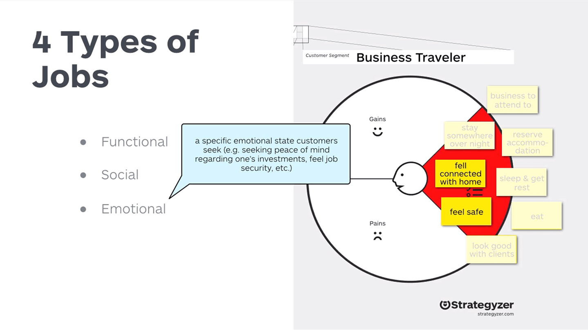
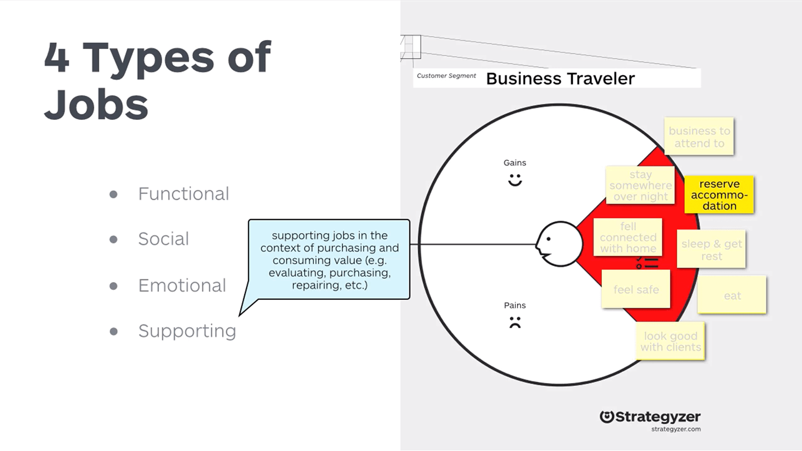
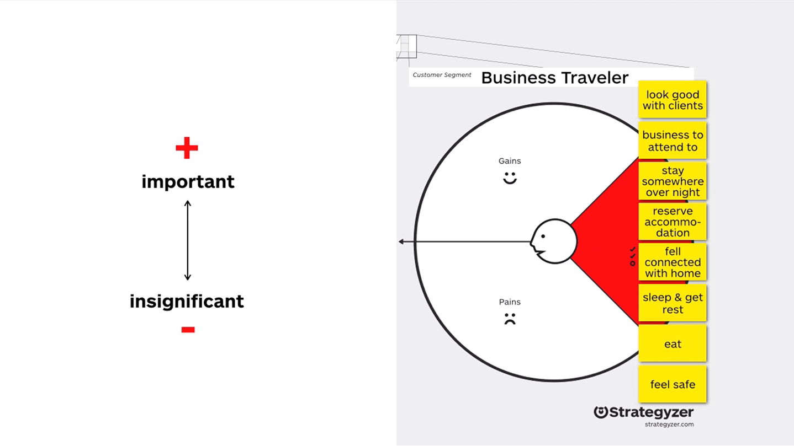
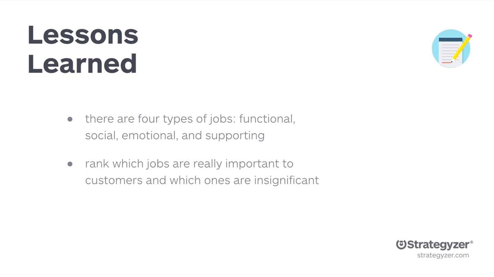

### STEP 6: Unbundling Customers

### STEP 7: Exercise
