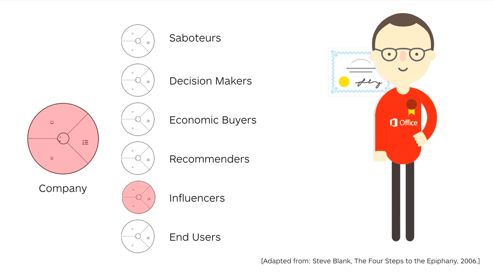
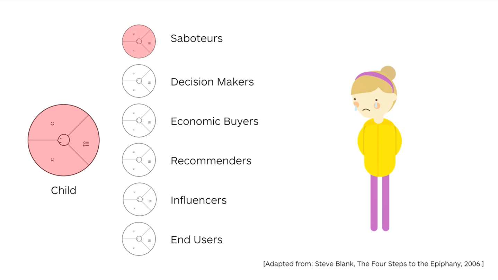
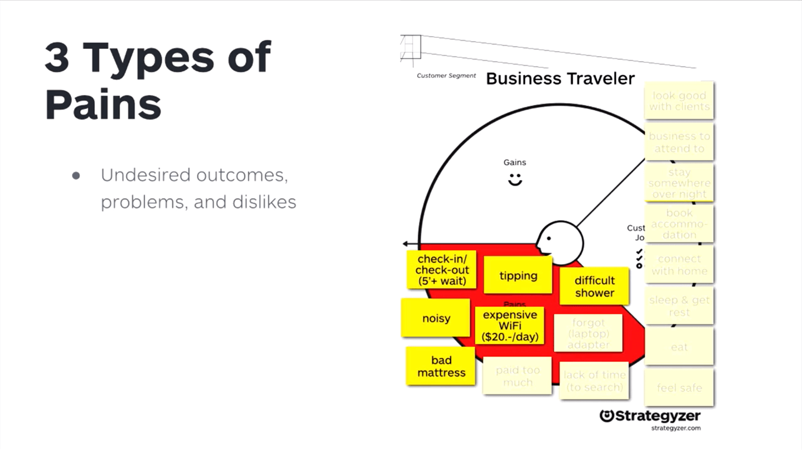
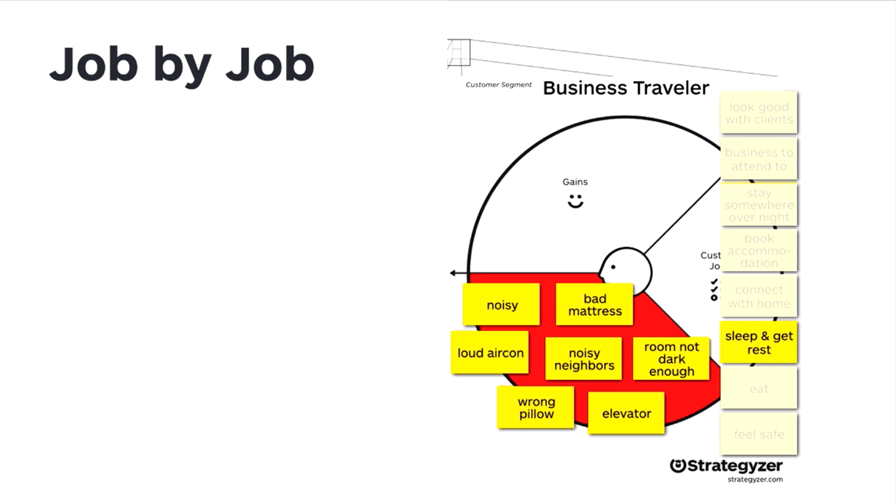

- [SECTION 1: Getting Started with the Value Proposition Canvas](#section-1-getting-started-with-the-value-proposition-canvas)
  - [LESSON 1: Introduction to the Value Proposition Canvas and Jobs-To-Be-Done](#lesson-1-introduction-to-the-value-proposition-canvas-and-jobs-to-be-done)
    - [STEP 1: Welcome](#step-1-welcome)
    - [STEP 2: Introduction](#step-2-introduction)
    - [STEP 3: Customer Jobs-To-Be-Done](#step-3-customer-jobs-to-be-done)
      - [Jobs-To-Be-Done](#jobs-to-be-done)
      - [Lessons Learned](#lessons-learned)
    - [STEP 4: Exercise - Jobs-To-Be-Done in Air Travel](#step-4-exercise---jobs-to-be-done-in-air-travel)
    - [STEP 5: Job Types](#step-5-job-types)
      - [Lessons Learned](#lessons-learned-1)
    - [STEP 6: Unbundling Customer Profiles](#step-6-unbundling-customer-profiles)
      - [Business](#business)
      - [Families](#families)
      - [Lessons Learned](#lessons-learned-2)
    - [STEP 7: Exercise](#step-7-exercise)
  - [LESSON 2: Customer Pains and Customer Gains](#lesson-2-customer-pains-and-customer-gains)
    - [STEP 1: Lesson Objectives](#step-1-lesson-objectives)
    - [STEP 2: Customer Pains](#step-2-customer-pains)
      - [Lessons Learned](#lessons-learned-3)

------------  
# SECTION 1: Getting Started with the Value Proposition Canvas
- [SECTION 1: Getting Started with the Value Proposition Canvas](#section-1-getting-started-with-the-value-proposition-canvas)
  - [LESSON 1: Introduction to the Value Proposition Canvas and Jobs-To-Be-Done](#lesson-1-introduction-to-the-value-proposition-canvas-and-jobs-to-be-done)
    - [STEP 1: Welcome](#step-1-welcome)
    - [STEP 2: Introduction](#step-2-introduction)
    - [STEP 3: Customer Jobs-To-Be-Done](#step-3-customer-jobs-to-be-done)
      - [Jobs-To-Be-Done](#jobs-to-be-done)
      - [Lessons Learned](#lessons-learned)
    - [STEP 4: Exercise - Jobs-To-Be-Done in Air Travel](#step-4-exercise---jobs-to-be-done-in-air-travel)
    - [STEP 5: Job Types](#step-5-job-types)
      - [Lessons Learned](#lessons-learned-1)
    - [STEP 6: Unbundling Customer Profiles](#step-6-unbundling-customer-profiles)
      - [Business](#business)
      - [Families](#families)
      - [Lessons Learned](#lessons-learned-2)
    - [STEP 7: Exercise](#step-7-exercise)
  - [LESSON 2: Customer Pains and Customer Gains](#lesson-2-customer-pains-and-customer-gains)
    - [STEP 1: Lesson Objectives](#step-1-lesson-objectives)
    - [STEP 2: Customer Pains](#step-2-customer-pains)
      - [Lessons Learned](#lessons-learned-3)

___
## LESSON 1: Introduction to the Value Proposition Canvas and Jobs-To-Be-Done

___
### STEP 1: Welcome

In this first lesson, we introduce the Value Proposition Canvas and how it can help you tell a story about the value your products and services create for customers. After this introduction, you will dive right into the heart of the Value Propositions Canvas by exploring the jobs-to-be done concept, customer pains, and customer gains. 

___
### STEP 2: Introduction  

[RESOURCE: The Value Proposition Canvas](/resources/canvases-and-main-tools/the-value-proposition-canvas.pdf)

[Video](https://platform.strategyzer.com/training/courses/mastering-value-propositions/1/1/2)

___
### STEP 3: Customer Jobs-To-Be-Done

The jobs-to-be done framework is the first of six building blocks within the Value Proposition Canvas. This method is different from traditional marketing approaches.

[Video](https://platform.strategyzer.com/training/courses/mastering-value-propositions/1/1/3)

- Origins of the #jtbd concept

Old way vs "Customer Jobs" way
- Traditional marketing used to describe WHO we are targeting and WHAT they want
- better to ask "what jobs are they trying to get done"
  - Henry Ford "If I had asked what people wanted they would have said 'a faster horse'".
  - Ask customers not what products they want, ask what JOB they are trying to get done.

#### Jobs-To-Be-Done
- what a customer is trying to get done (in her work or in her life). 
- includes
  - _tasks_ trying to perform and complete
  - _problems_ trying to solve
  - _needs_ trying to satisfy
- customers perform a job in a particular situation or context with more or less constraints


#### Lessons Learned
- the jobs-to-be-done approach focuses on what people are trying to get done, not just who they are and what they want
- customer jobs remain relatively stable over time, whereas value propositions (i.e. products & services) may change dramatically
- customers hire products and services to help them get a job done in a particular circumstance.

___
### STEP 4: Exercise - Jobs-To-Be-Done in Air Travel
Example: Imagine you are traveling by airplane to a business meeting. What jobs are you trying to get done as a business traveler?

```
- find a ride to the airport
- get to the hotel
- entertainment (books, magazines, etc.)
- move luggage around the airport
- get sleep on the airplane
- feel comfortable on the airplane
- get work done on the airplane
- feel connected with the home office
- dress appropriately for all anticipated occasions
- let business contacts know where I am and when to expect me
- let family know where I am and when to expect me
- find parking at the airport
- find my luggage if checked
- stay caffeinated
- maintain healthy eating habits while traveling
- maintain workout schedule while traveling
- find a place to workout (run) in foreign location
```

___
### STEP 5: Job Types
- 1) Function - tasks customers try to perform
- 2) Social - how customer want to be perceived by others
- 3) Emotional - a specific emotional state customers seek
- 4) Supporting - supporting jobs in the context of purchasing and consuming value

Categorize jobs and then rank them with the most important on top and least on the bottom. May need to GOOB for this.

Refer to the [Customer Jobs Trigger Questions](../resources/value-proposition-supporting-tools/customer-gains-trigger-questions.pdf)


#### Lessons Learned
- there are four types of jobs: functional, social, emotional, and supporting
- rank which jobs are really important to customers and which ones are insignificant

___
### STEP 6: Unbundling Customer Profiles

Business-to-business customers are normally composed of several customer segments. They should be "unbundled" into separate customer profiles.

Ask yourself which customer profiles you need to unbundle in a sometimes complex value chain. Define for which unbundled customers you need to map out a detailed Value Proposition Canvas.


#### Business




#### Families
Presumed:




Reality:


#### Lessons Learned
- In some contexts like B2B or families you need to "unbundle" the customer into separate cutomer profiles.
- Customer types could be end users, influencers, recommenders, economic buyers, decision makers, and saboteurs.
- Each customer profile has its own Value Proposition Canvas.

___
### STEP 7: Exercise
  
To complete this exercise:

- Print out or draw a [Customer Profile](../../resources/value-proposition-supporting-tools/the-customer-profile.pdf)
- Don't write on the canvas. Use sticky notes instead so you can move things around. Only write one idea per sticky note and don't use bullet points.
- Use the [Customer Jobs Trigger Questions](../../resources/value-proposition-supporting-tools/customer-gains-trigger-questions.pdf) if you need help listing your customer's jobs.
- Make sure you think of the jobs that really matter to your customers beyond those related directly to your products and services.

___
## LESSON 2: Customer Pains and Customer Gains  

___
### STEP 1: Lesson Objectives  
Pains are the negative outcomes that your customers want to avoid. Gains are the positive outcomes that your customers aim to achieve.  

___
### STEP 2: Customer Pains  








#### Lessons Learned  
- there are 3 types of pains: undesired outcomes, problems and dislikes / obstacles / risks
- rank which pains customers perceive as severe and which ones as moderate
- add pains one job at a time or in free form


