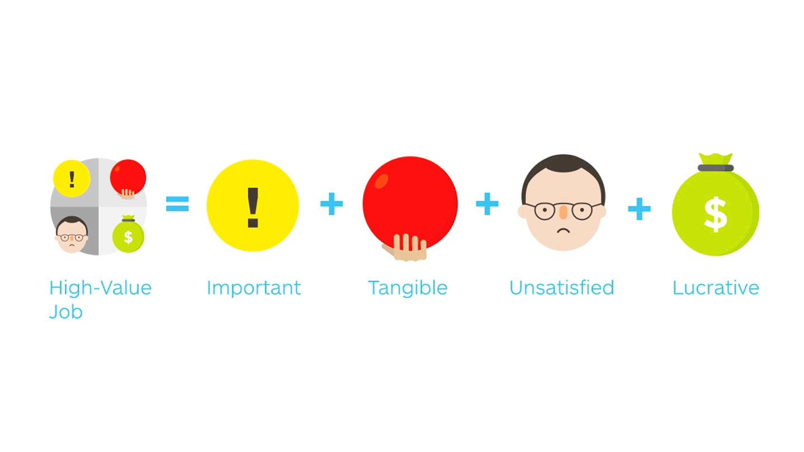
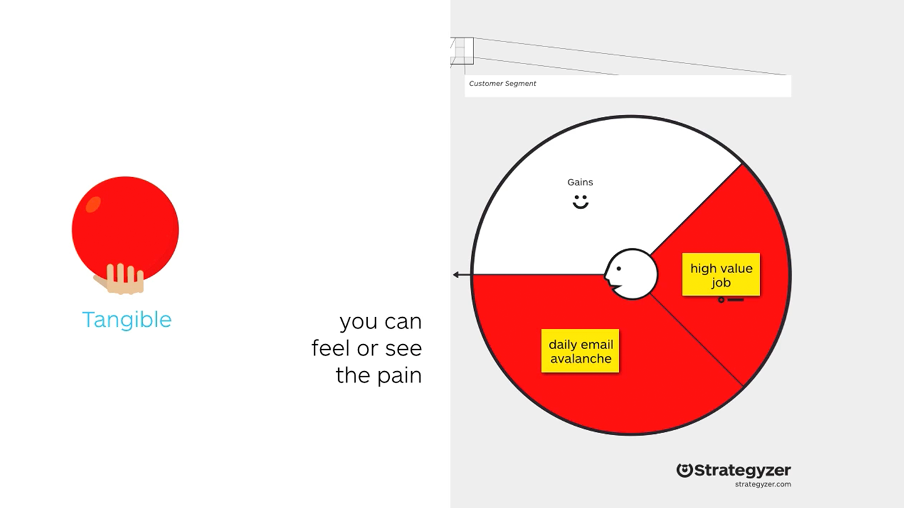

# This is an H1
___
## LESSON 2: Customer Pains and Customer Gains  

___
### STEP 1: Lesson Objectives  
Pains are the negative outcomes that your customers want to avoid. Gains are the positive outcomes that your customers aim to achieve.  

___
### STEP 2: Customer Pains  

How to Fill Out Pains in a Customer Profile  

...or use the Customer Pains Trigger Questions

#### Lessons Learned  
- there are 3 types of pains: undesired outcomes, problems and dislikes / obstacles / risks
- rank which pains customers perceive as severe and which ones as moderate
- add pains one job at a time or in free form

___
### STEP 3: Customer Gains  

#### 4 Types of Gains

Rank the gains from essential to nice-to-have

How to Fill Out Gains in a Customer Profile  

#### Lessons Learned
- there are four types of gains:
  - required
  - expected
  - desired
  - unexpected
- rank which gains customers perceive as essential and which ones as nice-to-have
- add gains one job at a time or in free form

___
### STEP 4: Case Study (Tesla)

___
### STEP 5: Best Practices

#### Mistakes:
1. Sketching out your customer profile with value proposition in mind
   - step into customer's shoes (empathy)
2. Focussing on too few Jobs, Pains, and Gains
3. Focussing on funtional jobs only
   - not just commuting to work, personal mobility, occasional long trip as in Tesla example
   - social and emotional too
4. Mixing jobs and outcomes
   - jobs describe WHAT they want to get done
   - pains describe what they want to AVOID
   - gains describe what they want to ACHIEVE
5. Being too vague with pains and gains
   - "250-350km" exactly vs "get to work"
6. Mixing too many **customers** into one profile

___
### STEP 6: Exercise - Map Out your Customer’s Pains and Gains

[See Figma](https://www.figma.com/file/mfgXjtyyBFfbUmVoIt1uQD/Strategyzer?node-id=3%3A248)

To do this exercise:

- Retrieve the Customer Profile that you started working on and add the customer pains and gains on sticky notes.
- Use the  if you need help listing your customer's pains.
- Use the  if you need help listing your customer's gains.
- Remember to go deep on customer pains and gains. The more you have, the better your understanding of your customers.

___
### STEP 7: Identify High-Value Jobs  

**Lessons Learned:**
- It's not enough to just look at which jobs are important to customers
- Some important jobs are more interesting to address for you as an organization than others
- High-value jobs are particularly important, tangible, unsatisfied, and lucrative

___
### STEP 8: Exercise

