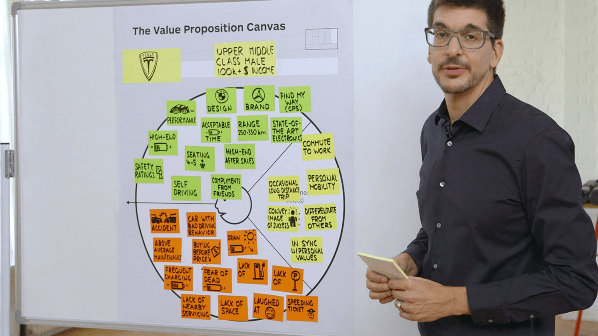

___
## LESSON 2: Customer Pains and Customer Gains  

___
### STEP 1: Lesson Objectives  
Pains are the negative outcomes that your customers want to avoid. Gains are the positive outcomes that your customers aim to achieve.  

___
### STEP 2: Customer Pains  

How to Fill Out Pains in a Customer Profile  

...or use the Customer Pains Trigger Questions

#### Lessons Learned  
- there are 3 types of pains: undesired outcomes, problems and dislikes / obstacles / risks
- rank which pains customers perceive as severe and which ones as moderate
- add pains one job at a time or in free form

___
### STEP 3: Customer Gains  

#### 4 Types of Gains

Rank the gains from essential to nice-to-have

How to Fill Out Gains in a Customer Profile  

#### Lessons Learned
- there are fourd types of gains: required, expected, desired, and unexpected
- rank which gains customers perceive as essential and which ones as nice-to-have
- add gains one job at a time or in free form

___
### STEP 4: Case Study (Tesla)

___
### STEP 5: Best Practices

#### Mistakes:
1. Sketching out your customer profile with value proposition in mind
2. 

___
### STEP 6: Exercise  

___
### STEP 7: Identify High-Value Jobs  

___
### STEP 8: Exercise

